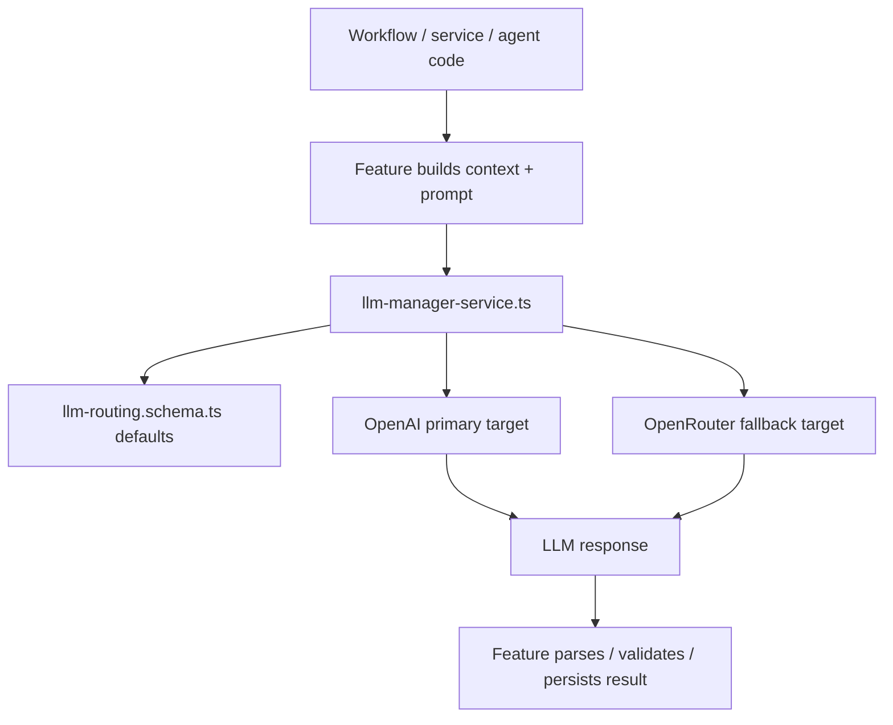

# LLM Routing And Provider Fallback

How TrustLoop keeps LLM execution consistent across `web`, `queue`, and `agents` without letting each feature invent its own provider logic.

## Why this exists

Before the centralized layer, different features instantiated provider clients directly and decided their own model/provider behavior inline. That created drift:

- support analysis had its own provider resolution in `apps/agents`
- support summary called OpenAI directly from `packages/rest`
- codex reranking and embeddings called OpenAI directly from separate modules
- capability checks were tied to `OPENAI_API_KEY`, even when a compatible fallback provider could exist

Now the repo has one shared routing contract and one shared runtime resolver so LLM-backed features all follow the same policy.

## Source of truth

The single source of truth is shared across two files with different responsibilities:

- `packages/types/src/llm/llm-routing.schema.ts`
  - defines the canonical provider names
  - defines the LLM use cases
  - defines the default model per use case
  - defines primary provider + fallback providers per use case
- `packages/rest/src/services/llm-manager-service.ts`
  - reads env availability
  - resolves which configured route is actually usable at runtime
  - normalizes provider-specific API details
  - executes the request through the primary target and retries on fallback targets

This split is intentional:

- `packages/types` owns the shared contract every app can import
- `packages/rest` owns runtime behavior that depends on env and client creation

## The flow

The mental model is:

```text
feature decides it needs an LLM
  -> feature builds prompt/context
  -> feature asks the shared manager for the route for that use case
  -> manager resolves provider/model/fallback
  -> caller executes through that route
  -> result flows back to the feature
```

In practice:



## What is centralized vs feature-owned

Two different responsibilities stay separate on purpose.

### Feature-owned

Each feature still owns:

- prompt construction
- context gathering
- response parsing and validation
- persistence and downstream side effects

Examples:

- support analysis builds thread snapshot + session digest context, then runs the agent
- support summary builds the customer-message prompt, then parses positional JSON
- codex reranking builds a code-snippet ranking prompt, then parses scores

### Shared-owned

The centralized layer owns:

- provider names (`openai`, `openrouter`)
- use-case names
- default model selection
- primary vs fallback order
- runtime provider availability checks
- OpenRouter base URL + required headers
- OpenRouter model slug normalization for OpenAI model names
- execute-primary-then-fallback behavior

So “single source of truth” does **not** mean one global prompt builder. It means every LLM caller asks the same shared layer how to run.

## Current use cases

The current registered use cases are:

- `support-analysis`
- `support-summary`
- `codex-rerank`
- `codex-embedding`

Today’s default policy is:

| Use case | Primary | Fallback | Notes |
|---|---|---|---|
| `support-analysis` | OpenAI | OpenRouter | Agent execution path |
| `support-summary` | OpenAI | OpenRouter | Short structured JSON summary |
| `codex-rerank` | OpenAI | OpenRouter | OpenAI-compatible chat completion |
| `codex-embedding` | OpenAI | none | Kept OpenAI-only to preserve embedding/vector compatibility |

## How apps stay consistent

All apps consume the same shared definitions instead of rolling their own:

- `apps/agents`
  - resolves the analysis route before creating the agent model
  - executes through the centralized fallback path
- `apps/queue`
  - should never choose a provider inline in workflow code
  - activities/services call shared LLM-aware services instead
- `packages/rest`
  - owns the shared runtime manager
  - feature services call it rather than instantiating provider clients ad hoc
- `apps/web`
  - should reflect the shared routing story in settings and operator-facing copy
  - does not define an alternate provider vocabulary

This means a routing-policy change lands in one place and every caller for that use case inherits it automatically.

## Env and runtime behavior

The routing layer currently uses these env vars:

- `OPENAI_API_KEY`
- `OPENROUTER_API_KEY` (optional)
- `APP_BASE_URL`
- `APP_PUBLIC_URL` (optional, preferred for OpenRouter headers when present)

Runtime behavior:

- if the primary provider is configured, it is used first
- if the primary provider fails and a fallback target exists, the manager retries on the fallback
- if no provider is configured for a use case, the caller gets a configuration error
- if every configured provider fails, the caller gets one aggregated execution error

## Current limitations

Important things this layer does **not** do today:

- it does not centralize prompt construction
- it does not choose policy per workspace yet
- it does not support arbitrary provider families beyond the registered OpenAI-compatible routes
- it does not enable embedding fallback, because vector dimensions/model compatibility are a hard contract with storage

## Invariants

- **All runtime LLM selection goes through the centralized manager.** New LLM-backed features must register a use case and resolve execution through the shared layer.
- **Prompt construction remains feature-owned.** The manager chooses how to run, not what to say.
- **Use-case policy lives in shared types.** Provider/model defaults are declared once and imported everywhere.
- **Fallback only applies where the API contract is known-compatible.** Embeddings stay pinned until compatibility is explicitly validated.
- **Workflows still do not perform direct I/O.** Temporal workflows call activities; activities/services call the manager.

## Related concepts

- `architecture.md` — big-picture service boundaries
- `ai-analysis-pipeline.md` — support analysis flow using the manager
- `codex-search.md` — hybrid search and reranking
- `spec-positional-json-format.md` — structured LLM output contract

## Keep this doc honest

Update when you change:

- the set of registered LLM use cases
- primary/fallback policy for any use case
- the provider list or env requirements
- the ownership boundary between prompt construction and shared routing
- whether embeddings can use fallback providers
- whether routing becomes workspace-configurable
