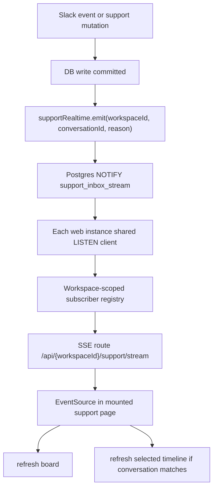

# Support Inbox Real-Time Updates (Workspace-Scoped) Engineering Spec

**Status:** Draft  
**Author:** Codex  
**Date:** 2026-04-19

## 1) Purpose

Define the implementation spec for making the support inbox update
immediately when new customer messages or support-side mutations land,
without requiring a browser refresh.

This spec is intentionally narrow:

1. real-time updates only for the mounted support inbox view
2. workspace-scoped delivery only
3. no cross-workspace fanout
4. no full WebSocket infrastructure unless later requirements justify it

## 2) Problem

Today the support inbox has two different freshness models:

- the board view (`apps/web/src/components/support/support-inbox.tsx`) loads
  `supportInbox.listConversations` and only refreshes on mount, manual
  refresh, or local mutations
- the conversation drawer already has separate timeline polling through
  `useConversationPolling`

This creates the user-visible bug:

- a customer sends a new message in Slack
- the support pipeline persists the new event and updates the projection
- the open support page does not reflect the change immediately
- the operator sees the new state only after a page refresh, manual refresh,
  or the next polling cycle

The temporary stopgap is a 10-second board poll on the mounted page. That
improves freshness, but it is still not "instant" and still creates repeated
read load while the page is open.

## 3) Goals / Non-Goals

### Goals

- New inbox activity should appear effectively immediately in the open
  support view.
- Updates must be isolated to the current workspace.
- The solution must work across multiple `web` instances.
- Browser load and DB read load should be lower than continuous polling.
- The current polling-based fallback should remain available during rollout.

### Non-Goals

- Typing indicators
- presence / "who is viewing this thread"
- collaborative draft editing
- cross-product event streaming outside support
- retrofitting all support reads to push full payload deltas
- replacing the existing analysis SSE flow in this phase

## 4) Decision

Use **Server-Sent Events (SSE)** for the browser transport and
**Postgres `LISTEN/NOTIFY`** for cross-instance invalidation fanout.

Do **not** use WebSockets for this feature.

### Why SSE over WebSockets

This feature is one-way:

- the server needs to tell the browser "something in this workspace's inbox
  changed"
- the browser does not need to send live messages back over the same channel

SSE fits that model better than WebSockets:

- simpler browser API (`EventSource`)
- simpler Next.js route-handler integration
- no socket lifecycle protocol or bidirectional message framing
- lower implementation complexity for auth and fanout
- consistent with the existing analysis stream pattern already in the repo

WebSockets would only be preferable if we later add:

- typing state
- operator presence
- optimistic shared cursor state
- collaborative draft editing
- high-volume bidirectional event flows

Those are not part of this requirement.

## 5) Current Reuse

Reuse the following patterns and files instead of inventing a new stack:

- `apps/web/src/hooks/use-analysis-stream.ts`
- `apps/web/src/app/api/[workspaceId]/analysis/[analysisId]/stream/route.ts`
- `packages/rest/src/services/support/analysis-stream-service.ts`
- `packages/rest/src/services/support/support-projection-service.ts`
- `apps/web/src/hooks/use-support-inbox.ts`
- `apps/queue/src/domains/support/support.activity.ts`
- `packages/rest/src/services/support/support-command/*`

What changes:

- analysis streaming is analysis-specific and effectively polling-backed
- inbox streaming needs true invalidation fanout across `web` instances

## 6) User Experience

When an operator has `/{workspaceId}/support` open:

- a new Slack customer message should appear on the board immediately
- if the relevant conversation is open, its timeline should refresh
  immediately
- status/assignment/reaction/retry updates made by another operator in the
  same workspace should also reflect immediately
- if the tab is hidden, the stream may pause; on visibility resume, the page
  should reconnect and perform one recovery refresh

When the operator is not on the support page:

- no support stream connection should be open

When the operator is on a different workspace:

- they must not receive this workspace's events

## 7) Architecture



### Core rule

The browser receives **invalidation events**, not full conversation payloads.

That means:

- server payloads stay tiny
- auth stays simpler
- the canonical source of truth remains the existing tRPC projection queries
- we avoid duplicating projection-shaping logic in the stream layer

## 8) Event Model

Add a new shared contract module:

- `packages/types/src/support/support-realtime.schema.ts`

Proposed shape:

```ts
export const SUPPORT_REALTIME_EVENT_TYPE = {
  connected: "CONNECTED",
  keepalive: "KEEPALIVE",
  conversationChanged: "CONVERSATION_CHANGED",
} as const;

export const SUPPORT_REALTIME_REASON = {
  ingressProcessed: "INGRESS_PROCESSED",
  statusChanged: "STATUS_CHANGED",
  assigneeChanged: "ASSIGNEE_CHANGED",
  replyQueued: "REPLY_QUEUED",
  deliveryUpdated: "DELIVERY_UPDATED",
  reactionChanged: "REACTION_CHANGED",
  attachmentUpdated: "ATTACHMENT_UPDATED",
} as const;
```

`conversationChanged` payload:

```ts
{
  type: "CONVERSATION_CHANGED",
  workspaceId: string,
  conversationId: string,
  reason: SupportRealtimeReason,
  occurredAt: string
}
```

Rules:

- include `workspaceId` and `conversationId`
- do not include message text, customer PII, attachment URLs, or any
  unneeded payload
- keep the event as invalidation metadata only

## 9) Server Design

### 9.1 New service

Create:

- `packages/rest/src/services/support/support-realtime-service.ts`

Add dependency:

- `pg` in `packages/rest/package.json` for the dedicated `LISTEN` client

Import style:

```ts
import * as supportRealtime from "@shared/rest/services/support/support-realtime-service";
```

Responsibilities:

1. validate and emit support invalidation events
2. own one shared Postgres `LISTEN` connection per `web` process
3. maintain an in-memory subscriber registry keyed by `workspaceId`
4. fan out events only to matching workspace subscribers
5. expose a small subscribe/unsubscribe API for the SSE route

### 9.2 Transport between processes

Use one Postgres channel:

- `support_inbox_stream`

Emit using `pg_notify` with parameterized payload, not string-built SQL.

This is important because `AGENTS.md` explicitly forbids manual SQL escaping.

Example design:

```sql
SELECT pg_notify('support_inbox_stream', $1)
```

Payload is JSON matching `supportRealtimeEventSchema`.

### 9.3 Shared listener lifecycle

Do **not** create a dedicated DB `LISTEN` connection per browser tab.

Instead:

- each `web` process lazily starts one listener client on first subscription
- that listener receives all support invalidation events
- it fans them out to in-process subscribers registered under each
  `workspaceId`

This keeps DB connection usage bounded:

- 1 listener connection per `web` instance
- not 1 listener connection per support page

### 9.4 Browser route

Add a first-party browser endpoint:

- `apps/web/src/app/api/[workspaceId]/support/stream/route.ts`

Also add a thin transport wrapper:

- `apps/web/src/server/http/support/support-stream.ts`

This endpoint is **not** under `/api/rest/*`.

Reason:

- `/api/rest/*` is reserved for service-key or workspace-API-key auth
- this stream is a first-party browser surface using session auth

### 9.5 Auth rules

The SSE route must:

1. resolve the signed-in user from the session
2. verify workspace membership for the `{workspaceId}` path param
3. register the subscriber only after auth succeeds
4. never stream events for any other workspace

If auth fails:

- return `401` or `403`
- do not open a stream

### 9.6 Connection semantics

The SSE route returns:

- `Content-Type: text/event-stream`
- `Cache-Control: no-cache, no-transform`
- `Connection: keep-alive`

Behavior:

- send one immediate `CONNECTED` event
- send a `KEEPALIVE` every 20-30 seconds
- unsubscribe on request abort
- close cleanly when the client disconnects

Set:

- `export const runtime = "nodejs"`
- `export const dynamic = "force-dynamic"`

for the stream route so it does not accidentally get treated as cacheable or
edge-hostile.

## 10) Event Emission Points

Emit support invalidation events only **after the authoritative write has
committed**.

### 10.1 Ingress pipeline

After the support projection transaction completes in:

- `apps/queue/src/domains/support/support.activity.ts`

emit:

- `reason: INGRESS_PROCESSED`

for the affected `workspaceId` and `conversationId`.

Important:

- workflows remain orchestration-only
- emit from the activity/service layer, not the Temporal workflow code

### 10.2 Support commands

Emit after successful writes in the support command services:

- assign -> `ASSIGNEE_CHANGED`
- status update / mark done -> `STATUS_CHANGED`
- send reply command persisted -> `REPLY_QUEUED`
- retry delivery state update -> `DELIVERY_UPDATED`
- reaction toggle -> `REACTION_CHANGED`

If attachment mirror state or delivery retry changes also alter the visible
timeline, emit a `DELIVERY_UPDATED` or `ATTACHMENT_UPDATED` invalidation there
as well.

### 10.3 No speculative events

Do not emit before the DB transaction commits.

Otherwise the client could refresh into a state that does not exist yet or
never commits.

## 11) Client Design

### 11.1 New hook

Create:

- `apps/web/src/hooks/use-support-inbox-stream.ts`

Responsibilities:

1. open an `EventSource` only when the support page is mounted
2. close the stream on unmount
3. optionally pause/reconnect based on document visibility
4. trigger targeted refreshes into `useSupportInbox`

### 11.2 Refresh strategy

On `CONVERSATION_CHANGED`:

- always refresh the board list
- refresh the selected timeline only if:
  - a conversation is selected, and
  - the event `conversationId` matches the selected conversation

This keeps work bounded.

The board list needs a refresh because:

- ordering may change
- stale badges/counts may change
- a new conversation may need to appear

The selected timeline refresh should be conversation-targeted to avoid
re-fetching the whole detail view for unrelated threads.

### 11.3 Backstop recovery

Keep a slow recovery path even after SSE lands:

- one refresh on reconnect
- one refresh on visibility regain
- optional low-frequency fallback poll, e.g. every 60-120 seconds

This guards against:

- missed events during deploys
- temporary connection drops
- browser/network hiccups

The existing 10-second poll can be removed after rollout confidence if the
slow recovery path proves sufficient.

## 12) Workspace Isolation

Workspace isolation is enforced in three layers:

1. **Route path scope**
   - stream endpoint is `/api/{workspaceId}/support/stream`

2. **Session authorization**
   - only authenticated members of that workspace can subscribe

3. **Server-side fanout filter**
   - subscriber registry is keyed by `workspaceId`
   - incoming NOTIFY payload is delivered only to subscribers registered for
     the same workspace

This means the feature updates "that user receiving message only or in that
view" in the practical sense:

- only operators currently viewing that workspace's support inbox receive the
  event
- other workspaces do not
- other pages do not

## 13) Performance and Stress

This design is lower-stress than page polling.

### Current polling model

With 10 open support pages and 10-second polling:

- 60 list queries per minute even if nothing changes

### Proposed SSE model

With 10 open support pages and no activity:

- 10 idle SSE connections
- 0 projection refresh queries besides keepalives

With activity:

- one tiny NOTIFY payload
- one fanout per relevant workspace
- only the open views in that workspace refresh

This is the key scaling benefit:

- persistent connections replace repeated read polling
- refresh queries happen on changes, not on a timer

## 14) Failure Handling

### Stream listener fails

If the shared `LISTEN` client disconnects:

- log a structured error with `workspaceId` omitted unless known
- reconnect with bounded retry/backoff
- keep existing subscribers registered in memory
- send a reconnect refresh once the browser stream resumes

### Browser stream fails

If `EventSource` errors:

- client marks stream as degraded
- client schedules reconnect
- client performs one immediate board refresh after reconnect succeeds

### Missed events

Because stream events are invalidations, not canonical state:

- any missed event is healed by the next recovery refresh

## 15) Observability

Add stable logs / counters around:

- stream subscribe / unsubscribe
- listener connected / disconnected / reconnecting
- event emitted
- event fanned out
- client refresh triggered by stream
- client reconnect attempts

Recommended metadata keys:

- `workspaceId`
- `conversationId`
- `eventType`
- `reason`

Do not log message text or full payload blobs.

## 16) Rollout Plan

### Phase 0

- keep current 10-second polling in place

### Phase 1

- ship SSE endpoint and shared listener
- open stream only on mounted support page
- refresh board + selected timeline on events
- keep polling as fallback

### Phase 2

- reduce polling to slow recovery only
- validate event loss / reconnect behavior

### Phase 3

- remove frequent polling entirely if SSE reliability is good

## 17) Testing

### Unit tests

- schema validation for support realtime events
- subscriber registry fanout by `workspaceId`
- event emission payload shape
- reconnect/backoff behavior for the listener

### Integration tests

- emit event for workspace A, assert only workspace A subscribers receive it
- emit event for conversation X, assert selected conversation refresh is
  triggered only for X
- auth failure on stream route returns no stream
- disconnect/unsubscribe cleans up subscriber registry

### UI tests

- support page opens one stream connection
- incoming invalidation refreshes the board
- selected thread refreshes only when its `conversationId` changes
- hidden-tab resume triggers one recovery refresh

## 18) File Plan

### Shared contracts

- `packages/types/src/support/support-realtime.schema.ts`
- `packages/types/src/support/index.ts`
- `packages/types/src/index.ts`

### Service layer

- `packages/rest/src/services/support/support-realtime-service.ts`

### Web transport

- `apps/web/src/server/http/support/support-stream.ts`
- `apps/web/src/app/api/[workspaceId]/support/stream/route.ts`

### Client

- `apps/web/src/hooks/use-support-inbox-stream.ts`
- `apps/web/src/hooks/use-support-inbox.ts`
- `apps/web/src/components/support/support-inbox.tsx`

### Emit-call sites

- `apps/queue/src/domains/support/support.activity.ts`
- `packages/rest/src/services/support/support-command/assign.ts`
- `packages/rest/src/services/support/support-command/status.ts`
- `packages/rest/src/services/support/support-command/reply.ts`
- `packages/rest/src/services/support/support-reaction-service.ts`

## 19) Explicit Non-Changes

Do not do these in this spec:

- full WebSocket server
- client-side reducer for incremental timeline patching
- Redis pub/sub
- cross-tab browser broadcast optimization
- support events outside the workspace-scoped inbox view

## 20) Open Questions

These are implementation-level choices, not product blockers:

1. keep the stream open in hidden tabs, or disconnect and reconnect on
   visibility regain
2. whether slow recovery polling should remain at 60s or 120s after rollout
3. whether delivery and attachment updates should be separate reasons or share
   one generic `CONVERSATION_CHANGED`

My recommendation:

- disconnect on hidden tabs
- keep a 60s recovery refresh at first
- keep reason enums explicit because they help debugging and metrics without
  changing client behavior
