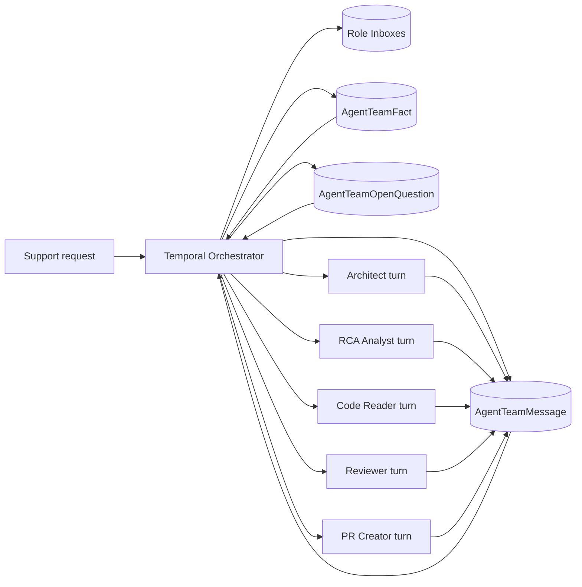

# Agent Team Addressed Dialogue — Implementation Plan

## Status

As of 2026-04-12, the core addressed-dialogue runtime is implemented, and the
support UI now includes:

- a live support-side agent-team panel in the conversation view
- SSE-backed rendering for messages, facts, open questions, and role inboxes
- browser E2E coverage via an isolated preview route for the panel flow

## 1) Goal

Upgrade agent-team execution from a handoff-only DAG into an **addressed dialogue system**:

- each role has a mailbox
- messages are persisted
- the orchestrator routes and schedules turns
- roles ask each other targeted questions and exchange evidence
- PR creation is gated by explicit review/approval signals

This should feel like a **Slack inbox + workflow engine**, not five agents speaking at once.

---

## 2) Product Principle

### Old model

```text
Architect runs
  -> leaves messages in shared history
  -> Reviewer reads them later
```

### New model

```text
Architect asks RCA a concrete question
  -> RCA wakes and answers
  -> Architect revises its hypothesis
  -> Reviewer challenges the proposal
  -> PR creator only runs after approval
```

### Moat

The moat is **not** "we have multiple agents".

The moat is:

- role specialization
- addressed inter-agent dialogue
- persisted collaborative state
- explicit reviewer gates
- auditable reasoning and decisions

---

## 3) Scope

### In scope

- addressed messages between roles
- per-role inboxes
- orchestrator wake/sleep scheduling
- shared fact ledger
- open question tracking
- reviewer approval gate before PR creation
- support-side live transcript can reuse this model later

### Out of scope for first version

- natural-language graph builder changes
- free-form arbitrary role creation
- long-lived always-on agent workers
- live multi-agent streaming to the support UI
- automatic conflict resolution between multiple simultaneous reviewers

---

## 4) Architecture



### Core rule

Roles do **not** invoke each other directly.

The orchestrator:

1. wakes one role
2. gives it a mailbox packet
3. persists emitted messages
4. decides which inboxes become queued next

---

## 5) Data Model

### 5A. Extend `AgentTeamMessage`

File: `packages/database/prisma/schema/agent-team.prisma`

Current `AgentTeamMessage` is too weak for addressed dialogue. Replace/expand it to:

```prisma
model AgentTeamMessage {
  id              String   @id @default(cuid())
  runId           String
  threadId        String
  fromRoleSlug    String                         // role slug or "system"
  toRoleSlug      String                         // role slug | "broadcast" | "orchestrator"
  kind            String                         // question | answer | evidence | challenge | approval | blocked | ...
  subject         String
  content         String   @db.Text
  parentMessageId String?
  refs            Json?                         // message IDs, issue IDs, file refs
  metadata        Json?
  createdAt       DateTime @default(now())

  run    AgentTeamRun      @relation(fields: [runId], references: [id], onDelete: Cascade)
  parent AgentTeamMessage? @relation("AgentTeamMessageParent", fields: [parentMessageId], references: [id], onDelete: SetNull)
  replies AgentTeamMessage[] @relation("AgentTeamMessageParent")

  @@index([runId, createdAt])
  @@index([runId, toRoleSlug, createdAt])
  @@index([runId, threadId, createdAt])
}
```

### 5B. Add `AgentTeamRoleInbox`

Each role gets one mailbox row per run.

```prisma
model AgentTeamRoleInbox {
  id                String   @id @default(cuid())
  runId             String
  roleSlug          String
  state             String   @default("idle")   // idle | queued | running | blocked | done
  lastReadMessageId String?
  wakeReason        String?
  unreadCount       Int      @default(0)
  lastWokenAt       DateTime?
  updatedAt         DateTime @updatedAt
  createdAt         DateTime @default(now())

  run AgentTeamRun @relation(fields: [runId], references: [id], onDelete: Cascade)

  @@unique([runId, roleSlug])
  @@index([runId, state, updatedAt])
}
```

### 5C. Add `AgentTeamFact`

Shared accepted truths. Keeps prompts small and convergent.

```prisma
model AgentTeamFact {
  id               String   @id @default(cuid())
  runId            String
  statement        String   @db.Text
  confidence       Float
  sourceMessageIds Json
  acceptedBy       Json
  status           String   @default("proposed") // proposed | accepted | rejected
  createdAt        DateTime @default(now())
  updatedAt        DateTime @updatedAt

  run AgentTeamRun @relation(fields: [runId], references: [id], onDelete: Cascade)

  @@index([runId, status, createdAt])
}
```

### 5D. Add `AgentTeamOpenQuestion`

Tracks what is unresolved and who owns it.

```prisma
model AgentTeamOpenQuestion {
  id              String   @id @default(cuid())
  runId           String
  askedByRoleSlug String
  ownerRoleSlug   String
  question        String   @db.Text
  blockingRoles   Json
  status          String   @default("open") // open | answered | dropped
  sourceMessageId String
  createdAt       DateTime @default(now())
  updatedAt       DateTime @updatedAt

  run AgentTeamRun @relation(fields: [runId], references: [id], onDelete: Cascade)

  @@index([runId, ownerRoleSlug, status, createdAt])
}
```

---

## 6) Shared Contracts

File: `packages/types/src/agent-team/agent-team-dialogue.schema.ts`

Define explicit message kinds and routing targets:

```ts
AGENT_TEAM_MESSAGE_KIND = {
  question,
  answer,
  request_evidence,
  evidence,
  hypothesis,
  challenge,
  decision,
  proposal,
  approval,
  blocked,
  tool_call,
  tool_result,
  status,
}

AGENT_TEAM_TARGET = {
  broadcast,
  orchestrator,
  architect,
  reviewer,
  code_reader,
  pr_creator,
  rca_analyst,
}
```

### Required schemas

- `agentTeamDialogueMessageSchema`
- `agentTeamRoleInboxSchema`
- `agentTeamFactSchema`
- `agentTeamOpenQuestionSchema`
- `agentTeamRoleTurnInputSchema`
- `agentTeamRoleTurnOutputSchema`

### Role turn output

Each role returns a bundle of state mutations, not just one message:

```ts
interface AgentTeamRoleTurnOutput {
  messages: AgentTeamDialogueMessage[]
  proposedFacts: AgentTeamFactDraft[]
  resolvedQuestionIds: string[]
  nextSuggestedRoles: AgentTeamRoleSlug[]
  done: boolean
  blockedReason?: string
}
```

This is cleaner than inferring everything from raw text.

---

## 7) Agent Service Changes

### 7A. New endpoint

File: `apps/agents/src/server.ts`

Add:

```text
POST /team-turn
```

Input:

```ts
{
  workspaceId,
  runId,
  role,
  requestSummary,
  inbox,
  acceptedFacts,
  openQuestions,
  recentThread
}
```

Output:

```ts
AgentTeamRoleTurnOutput
```

### 7B. Prompt contract by role

Each role prompt must be rewritten around inbox processing, not generic analysis.

#### Architect

- allowed to ask `question`
- allowed to issue `request_evidence`
- allowed to write `hypothesis`
- allowed to emit `proposal`
- not allowed to emit `approval`

#### RCA Analyst

- allowed to answer questions about runtime truth
- allowed to emit `evidence`
- not allowed to propose PRs

#### Code Reader

- allowed to emit code-path evidence
- should cite files/functions whenever possible

#### Reviewer

- allowed to emit `challenge`
- allowed to emit `approval`
- should block PR creation if evidence is weak

#### PR Creator

- only role allowed to call `createPullRequest`
- requires reviewer approval or explicit orchestrator override

### 7C. Output discipline

All role prompts should produce structured output only. No free-form prose outside the message protocol.

---

## 8) Orchestrator Design

### 8A. Replace pure DAG execution with mailbox scheduling

File: `apps/queue/src/domains/agent-team/agent-team-run.workflow.ts`

Current model:

- compute DAG batches
- execute ready roles
- append messages

New model:

1. initialize inbox rows for every configured role
2. seed the architect inbox as `queued`
3. loop until termination

### 8B. Workflow loop pseudocode

```ts
while (!isRunTerminated(runState)) {
  const nextInbox = await activities.claimNextQueuedInbox(runId);

  if (!nextInbox) {
    if (hasOpenQuestions(runState) || hasBlockedRoles(runState)) {
      await activities.markRunWaiting(runId);
      break;
    }

    break;
  }

  const turnInput = await activities.buildRoleTurnInput({
    runId,
    roleSlug: nextInbox.roleSlug,
  });

  const result = await activities.runTeamTurnActivity(turnInput);

  await activities.persistRoleTurnResult({
    runId,
    roleSlug: nextInbox.roleSlug,
    result,
  });

  await activities.routeNewMessages({
    runId,
    roleSlug: nextInbox.roleSlug,
    result,
  });
}
```

### 8C. Routing logic

File: `apps/queue/src/domains/agent-team/agent-team-routing.ts`

Rules:

- direct-addressed messages queue the target inbox
- `broadcast` messages do not wake all roles automatically
- `approval` from reviewer unlocks `pr_creator`
- `blocked` from any role re-queues `architect`
- `request_evidence` queues the addressed evidence owner
- `question` queues the addressed role

### 8D. Wake constraints

- max messages per role: `8`
- max total messages per run: `40`
- max unanswered questions per role: `3`
- max total turns per run: `20`

These are mandatory. Otherwise the workflow degenerates into loops.

---

## 9) Routing Permissions

File: `packages/types/src/agent-team/agent-team-routing-policy.ts`

Hard-code first version:

```ts
architect -> [rca_analyst, code_reader, reviewer, pr_creator]
rca_analyst -> [architect, reviewer]
code_reader -> [architect, reviewer]
reviewer -> [architect, pr_creator]
pr_creator -> [architect, reviewer]
```

Validation rule:

- roles may only address allowed recipients
- invalid routing becomes a workflow error

Do not make this user-configurable in v1.

---

## 10) Fact Ledger + Open Question Rules

### Facts

Facts are accepted when:

- one role proposes a fact
- another role confirms it, or
- reviewer approves it, or
- orchestrator auto-accepts tool-backed evidence above a confidence threshold

### Questions

Open questions are created when:

- a role emits `question`
- a role emits `request_evidence`
- a role emits `blocked` and names a dependency

Questions are resolved when:

- target role emits `answer` or `evidence`
- refs point back to the original question

This gives the run a real state machine instead of vague transcript growth.

---

## 11) UI Plan

### 11A. Support conversation panel

File: `apps/web/src/components/support/agent-team-chat-panel.tsx`

Render the conversation as:

- per-role inbox transcript
- threaded addressed messages
- badges for `question`, `evidence`, `challenge`, `approval`
- explicit "blocked waiting on RCA" state

### 11B. Run state summary

Show:

- active role
- queued inboxes
- blocked inboxes
- accepted facts
- open questions
- approval status
- PR status

### 11C. Team config UI

Future extension:

- optional routing policy preview
- allowed message kinds per role
- reviewer gate enabled/disabled

Do not put this in the first rollout.

---

## 12) Delivery Phases

### Phase 1: Protocol + Storage

- [ ] extend `AgentTeamMessage`
- [ ] add `AgentTeamRoleInbox`
- [ ] add `AgentTeamFact`
- [ ] add `AgentTeamOpenQuestion`
- [ ] add shared Zod/TS schemas
- [ ] migration + Prisma generation

### Phase 2: Agent Service Turn Contract

- [ ] add `POST /team-turn`
- [ ] role turn input/output schemas
- [ ] update role prompts for addressed dialogue
- [ ] add unit tests for output validation

### Phase 3: Orchestrator Rewrite

- [ ] replace pure DAG execution with inbox scheduling
- [ ] add routing engine
- [ ] add loop guards and termination rules
- [ ] persist facts/questions/inbox state
- [ ] add workflow tests

### Phase 4: Reviewer Gate + PR Rules

- [ ] require reviewer approval before PR creation
- [ ] validate PR proposals cite evidence
- [ ] block PR creator when approval is absent

### Phase 5: Support UI

- [ ] team chat panel with addressed dialogue
- [ ] status indicators for inboxes/facts/questions
- [ ] live stream support if needed

---

## 13) Test Plan

### Unit

- routing policy validation
- message kind validation
- fact acceptance rules
- open question resolution rules
- reviewer gate logic

### Workflow

- architect asks RCA, RCA answers, architect resumes
- reviewer challenge re-queues architect
- approval unlocks PR creator
- blocked message creates open question and pauses role
- infinite loop guard terminates correctly

### Integration

- `/team-turn` returns valid turn bundle
- persisted inbox state reflects addressed messages
- fact ledger updates after evidence/approval
- PR creator rejected without reviewer approval

### UI

- transcript renders addressed messages correctly
- blocked state appears in support panel
- approval visibly unlocks PR stage

---

## 14) Key Decisions

| Decision | Choice | Why |
|----------|--------|-----|
| Agent communication | persisted addressed messages | auditable, schedulable, token-efficient |
| Role runtime | wake-on-message | cheaper and more deterministic than live concurrent agents |
| Long-term memory | fact ledger + open questions | prevents prompt bloat and transcript chaos |
| PR gating | reviewer approval required | builds trust and reduces bad PRs |
| Routing policy | fixed by role type in v1 | safer than user-defined unrestricted messaging |
| Broadcast behavior | visible to all, wakes none by default | avoids noisy fan-out |

---

## 15) Success Criteria

We know this worked when:

- agents ask each other targeted questions instead of only handing off
- reviewer can block weak proposals before PR creation
- conversation history is legible to a human operator
- accepted facts converge over time
- PR creator only runs when the team has enough evidence
- token usage stays bounded because roles read inbox packets, not the entire transcript

---

## 16) First Build Recommendation

Do not try to ship all of this at once.

**Best first implementation slice:**

1. addressed messages
2. per-role inbox table
3. `question` / `answer` / `evidence` / `challenge` / `approval`
4. reviewer gate before PR creation

That is enough to feel like a real collaborative engine, and enough to prove whether the moat is real.
