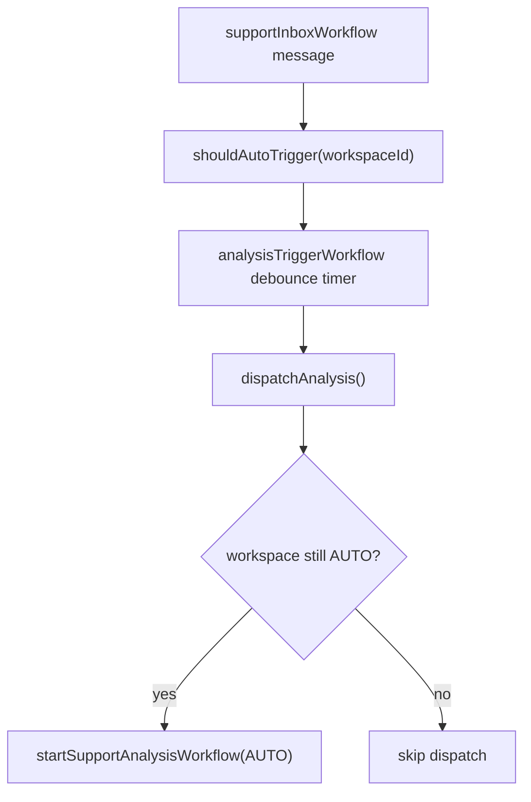

# Rolling Analysis Trigger Switch

**Status:** Draft
**Author:** Duc
**Date:** 2026-04-12

## Problem

The AI Analysis trigger mode setting (AUTO/MANUAL) cannot be changed while conversations are actively flowing in. Customers send messages continuously — there's never a "quiet" moment to flip the switch. The admin needs to change the setting at any time, with the new mode applying to all messages arriving **after** the change.

## Current Architecture

```
Customer message arrives
  → supportInboxWorkflow
    → shouldAutoTrigger(workspaceId)   // reads Workspace.analysisTriggerMode
    → if AUTO: signal or start analysisTriggerWorkflow (5-min debounce)
    → if MANUAL: do nothing
      ...5 min of silence...
    → analysisTriggerWorkflow timer expires
    → dispatchAnalysis()               // fires unconditionally ← GAP
```



### What already works

The `shouldAutoTrigger` activity runs **per message** in `supportInboxWorkflow`. This means:

- **AUTO → MANUAL switch**: New messages immediately stop creating/signaling debounce workflows. ✅
- **MANUAL → AUTO switch**: New messages immediately start creating debounce workflows. ✅

### The gap

Already-running debounce workflows (`analysisTriggerWorkflow`) don't re-check the workspace setting before dispatching. When the 5-minute timer expires, `dispatchAnalysis()` fires unconditionally.

**Scenario:** Admin switches AUTO → MANUAL at T+2min. A debounce workflow started at T+0 still fires at T+5. The customer sees an auto-analysis they didn't expect after the admin turned auto off.

## Solution: Gate dispatch on current setting

Add a `shouldAutoTrigger` check inside `dispatchAnalysis()` before starting the analysis workflow. The debounce workflow still sleeps to completion (cheap — just Temporal state), but the final dispatch is gated on the **current** setting at dispatch time.

This is a 1-line gate. No workflow cancellation, no enumeration of running workflows, no new signals.

### Why not cancel running debounce workflows?

- Requires enumerating all `analysis-debounce-*` workflows for the workspace (Temporal doesn't index by workspace)
- Adds complexity to the settings mutation (cross-service call to Temporal)
- Debounce workflows are cheap (sleeping state, no resources)
- The gate approach achieves the same user-visible outcome with zero additional infrastructure

## Changes

### 1. Gate `dispatchAnalysis` on current setting

**File:** `apps/queue/src/domains/support/support-analysis-trigger.activity.ts`

```typescript
export async function dispatchAnalysis(input: {
  workspaceId: string;
  conversationId: string;
}): Promise<void> {
  // Rolling switch: re-check setting at dispatch time, not at message time.
  // If admin switched to MANUAL after the debounce started, skip dispatch.
  const autoEnabled = await shouldAutoTrigger(input.workspaceId);
  if (!autoEnabled) return;

  try {
    await temporalWorkflowDispatcher.startSupportAnalysisWorkflow({
      workspaceId: input.workspaceId,
      conversationId: input.conversationId,
      triggerType: "AUTO",
    });
  } catch {
    // Workflow already running or completed for this conversation. Fine.
  }
}
```

**Why:** This closes the only gap. The debounce workflow's timer still runs (harmless), but the actual analysis dispatch respects the setting as of dispatch time — not as of message-arrival time.

### 2. Update UI copy to explain rolling behavior

**File:** `apps/web/src/app/[workspaceId]/settings/ai-analysis/page.tsx`

Add a note under the mode description explaining that changes take effect for new messages:

```
Automatic mode
TrustLoop AI waits for the customer to stop sending messages (5 minute window),
then automatically analyzes the conversation and generates a draft response.
The draft appears in the inbox for your review.

Changes take effect immediately for new messages. Conversations already waiting
for the quiet window will respect the updated setting.
```

For Manual mode:

```
Manual mode
Click the "Analyze" button on each conversation to trigger analysis.
No automatic analysis runs. Useful when you want full control over which
conversations get analyzed.

Switching to manual stops future auto-analysis. Any conversation currently
in the quiet window will not be auto-analyzed.
```

### 3. Confirm UI has no unnecessary disabled state

**File:** `apps/web/src/app/[workspaceId]/settings/ai-analysis/page.tsx`

Current: `disabled={saving || loading}` — only disabled during network operations. ✅ No changes needed. The dropdown is always changeable once loaded.

### 4. Add audit trail clarity

**File:** `packages/rest/src/workspace-router.ts` (line 365)

The existing `writeAuditEvent` already logs the mode change with `metadata: { triggerMode }`. No changes needed — admins can see when the switch happened in the audit log.

## Non-changes (explicitly out of scope)

| Item | Why |
|---|---|
| Cancel running debounce workflows on switch | Unnecessary complexity; gate achieves same outcome |
| Retroactive analysis for MANUAL → AUTO | Messages during MANUAL mode were intentionally skipped |
| Per-conversation mode override | Not requested; workspace-level is correct for now |
| Debounce window configuration | Separate feature; 5 min default is fine |

## Edge cases

| Scenario | Behavior |
|---|---|
| AUTO → MANUAL, debounce timer expires 1 sec later | `dispatchAnalysis` re-checks setting → sees MANUAL → skips. ✅ |
| MANUAL → AUTO, old conversation has no debounce | No retroactive trigger. Admin can click "Analyze" manually for those. ✅ |
| Rapid toggle AUTO → MANUAL → AUTO | Each message checks current setting. Debounce dispatch checks again. Always consistent with latest setting. ✅ |
| Two admins toggle at the same time | Last write wins (Prisma update). Audit log captures both. Standard. ✅ |
| Setting changes mid-analysis (GATHERING_CONTEXT/ANALYZING) | In-flight analysis runs to completion. The gate only affects dispatch, not running analyses. ✅ |

## Testing

1. **Unit test** for `dispatchAnalysis`: Mock `shouldAutoTrigger` returning false → verify no workflow dispatch.
2. **Integration path**: Switch setting to MANUAL while a debounce workflow is sleeping → verify analysis never dispatches.
3. **UI test**: Verify dropdown is interactive immediately after page load (not blocked by in-flight state).

## Size estimate

- 1 file change with logic (activity gate): ~5 lines
- 1 file change with copy (UI description): ~10 lines
- 1 test file: ~30 lines
- Total: ~45 lines. Single PR, single commit.
